# DDL: Data Definition Language
Sirve para definir las estructuras que almacenarán los datos así como los procedimientos o funciones que permitan consultarlos: create, alter y drop.

### 3.	Crear y Eliminar Bases de Datos
•	Ingresamos create database [nombre de la base de datos] y ejecutamos.
    
   
 
•	Para actualizar la base de datos, damos click derecho en “Base de Datos” y click a “Actualizar”. Ahora podemos visualizar la nueva base de datos.

   

•	Para poder realizar modificaciones en la base de datos, se debe trabajar dentro de ella. Ingresar la sentencia use [nombre de la base de datos] y ejecutamos. Para confirmar, verificar que en la parte superior se encuentra el nombre de la base de datos.

   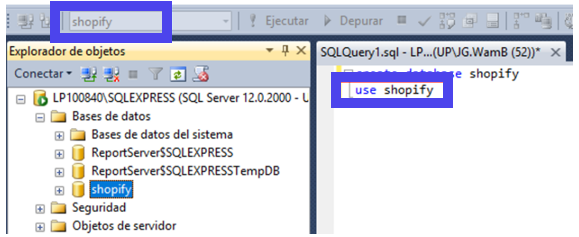

•	De haber algún inconveniente y de ser necesario eliminar la base de datos hacemos lo siguiente: Primero, nos ubicamos en otra base de datos con el comando anterior (por lo general use master). Segundo verificamos que ya salimos. Tercero, digitamos la sentencia drop database [nombre de la base de datos]. Por último, actualizamos “Bases de datos” como en el paso 2, donde ya no deberíamos visualizarla.

   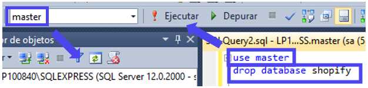 

### 4.	Crear Tablas
•	Caso: La librería UP tiene las tablas mostradas debajo. Se sabe que un cliente puede comprar varios libros, y un libro puede ser comprado por varios clientes, por lo que la relación es de muchos a muchos entre ambas tablas (N:M). La tabla entre ambas es la de compra, la cual nos servirá para poder mostrar la relación e ingresar los datos.

    

•	Tablas Entidades:
En una nueva consulta ingresamos las siguientes sentencias, para crear las tablas que necesitaremos.
 
   

•	Tabla Relación:
La clave primaria de la relación se originará de ambas claves primarias de las tablas. Para que se pueda establecer la relación, las claves foráneas también son atributos.

   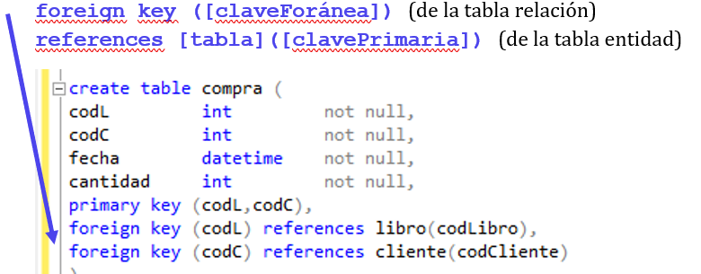
 

### 5.	Modificar y Eliminar Tablas

•	Del caso anterior, sabemos que algunos libros son actualizados cada cierto período y se publican nuevas ediciones. Cada vez que requeramos añadir un nuevo atributo a una tabla, usaremos el comando:
alter table [nombreTabla] add [nombreAtributo] [tipoDato];

Añadiremos esta sentencia para agregar el atributo “edición” fuera de las sentencias de la tabla “Libro”.
 
  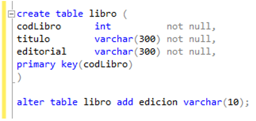

•	Más adelante conoceremos un comando que emplearemos todo el tiempo, solo por esta ocasión verificaremos de la siguiente manera que se agregó exitosamente el atributo: Nos dirigimos a “Shopify” > Tablas > dbo.libro (o el nombre de tabla asignado) > Columnas. Al final de esta ruta está el nuevo atributo.

  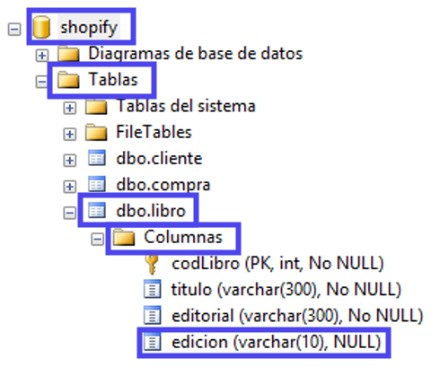 

•	De haber algún inconveniente y de ser necesario eliminar alguna de las tablas, digitamos el comando  drop table [nombreTabla];. Supongamos que creamos la tabla “Librería”, entonces procederemos a eliminarla.

  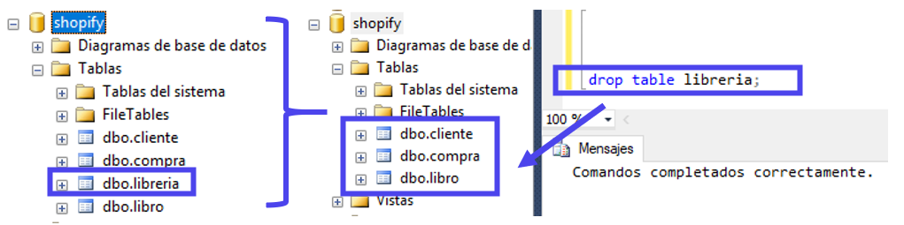  
 


### 6.	Generar Diagramas de la Base de Datos

•	Actualicemos la base de datos. Damos click derecho en “Base de Datos”, damos click a “Actualizar”. Abrimos las “Tablas”. Ahora podemos visualizar las tablas creadas.

  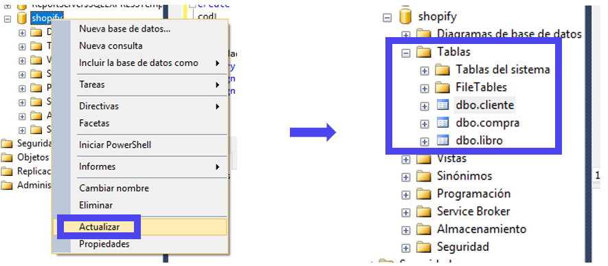                                     

•	Si los atributos como las llaves fueron descritos correctamente, al generar el diagrama de las bases de datos, las relaciones se generarán automáticamente. Dentro de nuestra base de datos, damos click derecho en “Diagrama de base de datos”, luego a “Nuevo diagrama de base de datos”. En la ventana emergente, seleccionamos todas las tablas creadas para agregarlas con un solo click (esto será más útil cuando tengamos muchas tablas).
 
  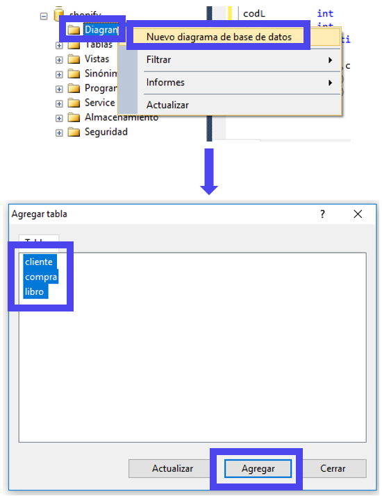


•	Si deseamos agregar todas las tablas, tendremos la ventana emergente vacía; si deseamos agregar solo algunas, verifiquemos que fuera se hallen las que requerimos. En este caso, agregaremos todas. Al cerrar, obtendremos el diagrama con las relaciones que indicamos en las sentencias. Nota: Si no logramos el objetivo, entonces eliminamos la hoja y corregimos las llaves de las sentencias en la consulta.


   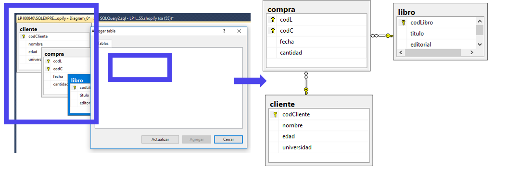 
	 

•	Es muy importante tener diagramas de cada relación y el diagrama general de la base de datos. Para guardarlos, damos click derecho en la hoja donde se ubica nuestro diagrama, damos click a “Guardar…”. Escogemos un nombre que sugiera la relación del diagrama, así cuando tengamos varios nos podremos dirigir fácilmente a él.

  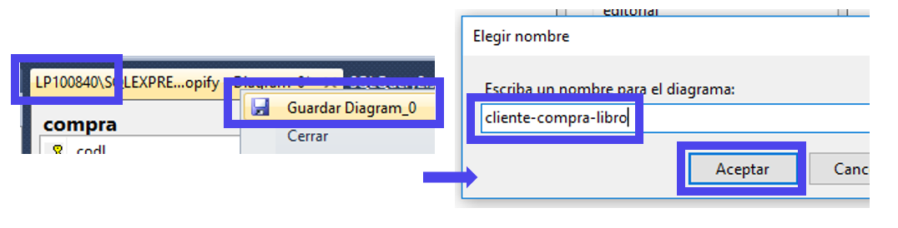
 
•	Actualicemos “Diagramas de bases de datos” dando click derecho y click a “Actualizar”. Esperamos a que nos aparezca el botón “+” de expansión y abrimos “Diagrama de base de datos”, donde se hallará guardado el diagrama de la relación “cliente-compra-libro”.


  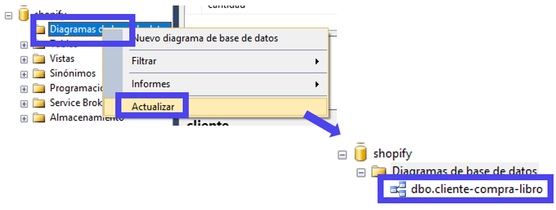
 

 


```python

```
