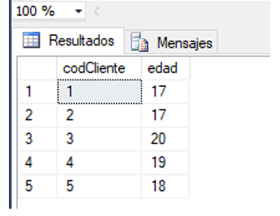
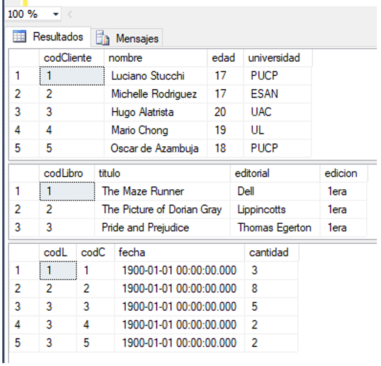
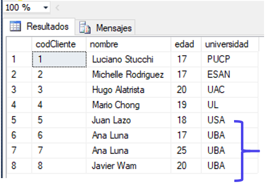
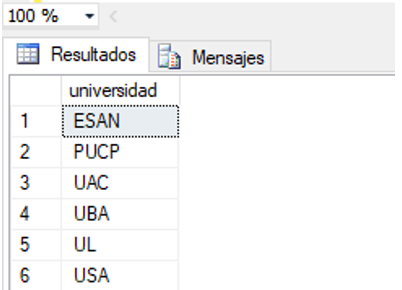
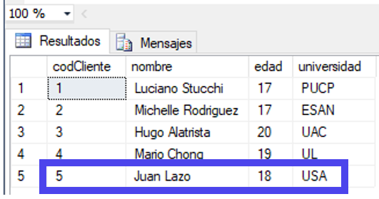

# DML: Data Manipulation Language
Permite introducir datos para realizar tareas de consultas o modificación de los datos que contienen las Bases de Datos: insert, select, update y delete.

### 1.	Insertar valores

•	Los datos que ingresemos deben mantener la estructura en que fueron ordenados los atributos (en las sentencias de las tablas), y deben obedecer a los tipos de datos indicados. La sentencia correspondiente para añadir una tupla es la que sigue:


```python
insert into [nombreTabla] values (valor1,valor2,valor3,…);
```


•	Si requerimos añadir varias tuplas, podemos repetir la misma sentencia.

    

•	También podemos separar una tupla de otra con comas:

   

•	Si se efectuó con éxito entonces veremos este mensaje en la consola:

   

 
### 2.	Select

•	Para mostrar todos los registros, con datos que corresponden a una columna o varias, de una determinada tabla:


```python
select [nombreColumna1], [nombreColumna2], …
from [nombreTabla]
```

   


```python
select [* = todas las columnas]
from [nombre Tabla]
```

   
   
### 2. 	Select Distinct

•	Respecto al caso, si quisiéramos saber cuáles son todas las universidades cuyos alumnos han comprado en la librería, necesitamos quitar duplicados de los registros, pues varios alumnos pueden provenir de la misma universidad. A continuación, agregaremos 3 registros más, cuyos estudiantes sean de la ‘UBA’.

   

•	Verificamos que se hayan agregado los nuevos registrados son select.


```python
select * from cliente
```



•	Para mostrar todos los registros  sin duplicados, con datos que corresponden a una columna o varias, de una determinada tabla:


```python

select distinct [nombreColumna1], [nombreColumna2], …
from [nombreTabla]

```

### 3.	Update

•	Para modificar datos ya existentes en una tabla:


```python
select district universidad 
from cliente
```

   


```python
update [nombreTabla],
set [nombreAtributo1]=[valor1], [nombreAtributo2]=[valor2], …
where [condición]

```

•	En este caso, modificaremos el registro 5.

    

•	Modificaremos el nombre, la edad y la universidad del codCliente 5, y ejecutamos.

   


```python
update cliente
set nombre='Juan Lazo', edad, universidad='USA'
where codCliente=5;
```

•	Consultamos con select los registros de la tabla cliente, y vemos que se actualizó exitosamente.


```python
select * from cliente
```

   


### 4.	Delete

## Contenido:

<a href="https://fing-up.github.io/Ingenieria-de-datos/sql/Introduccion.html/">I.	Introducción a SQL</a>

<a href="https://fing-up.github.io/Ingenieria-de-datos/sql/DDL.html/">II.	DDL: Data Definition Language</a>


```python

```
