# Introducción a SQL

### 1.	Abrir Microsoft SQL Server
•	En el buscador ingresamos “SQL Server 2014 Management Studio”

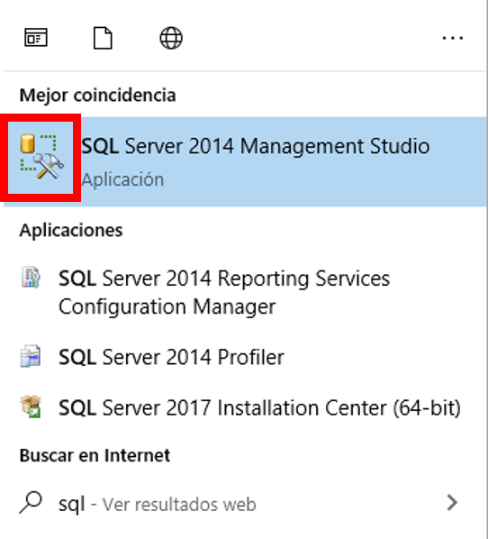

•	Verificamos que en la ventana emergente estén seleccionadas las opciones “Motor de base de datos” y “Autenticación de Windows”. No debemos ingresar ni usuario ni clave. Damos click en “Conectar”.

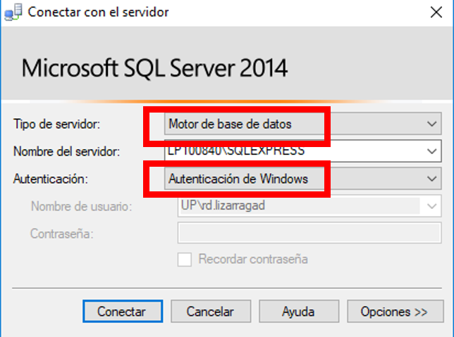

•	Si procedimos de manera correcta, debería verse de la siguiente manera. Si detectamos algún problema, pasar al acápite “En caso de error”, al final de esta sección.

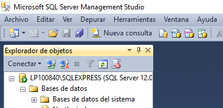

•	De ahora en adelante, cada vez que trabajemos en SQL, debemos abrir el espacio de trabajo “Nueva consulta”. Cuando queramos ejecutar las sentencias, damos click a “Ejecutar”. Nota: Este botón ejecuta todas las sentencias, para ejecutar solo una parte de las sentencias se deberá seleccionar las sentencias debidas.

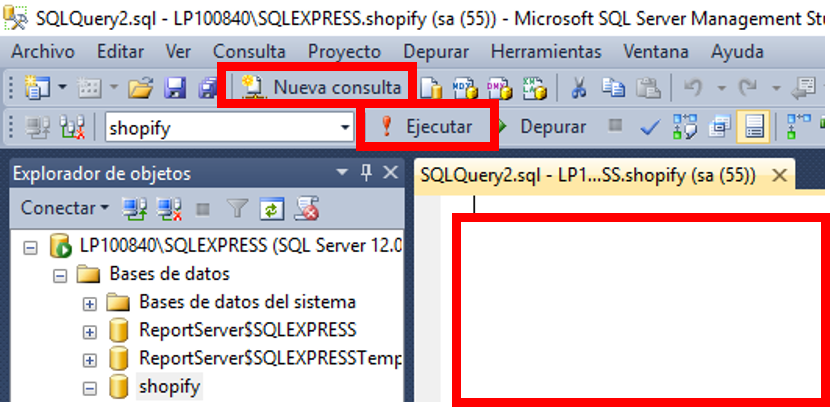

•	Para guardar las consultas, nos dirigimos a Archivo > Guardar [nombre].sql como…

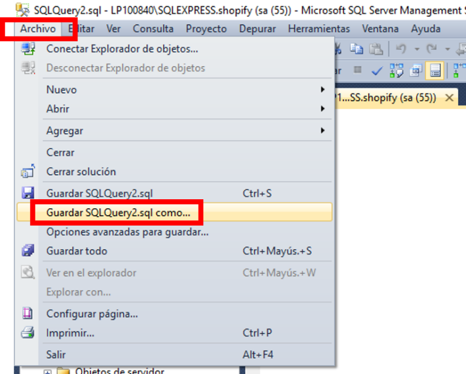

En caso de error:
•	Puede que se haya procedido de manera correcta y aun así aparezca un mensaje de error como el siguiente.

•	Para solucionarlo, nos dirigimos al Administrador de Tareas (Ctrl+Alt+Supr), vamos a la pestaña “Servicios”, damos click derecho en MSSQL$SQLEXPRESS o el nombre con el que no se pudo ingresar, damos click a “Iniciar”. Una vez que el estado sea “En ejecución”, abrimos de nuevo SQL, siguiendo los pasos anteriores.

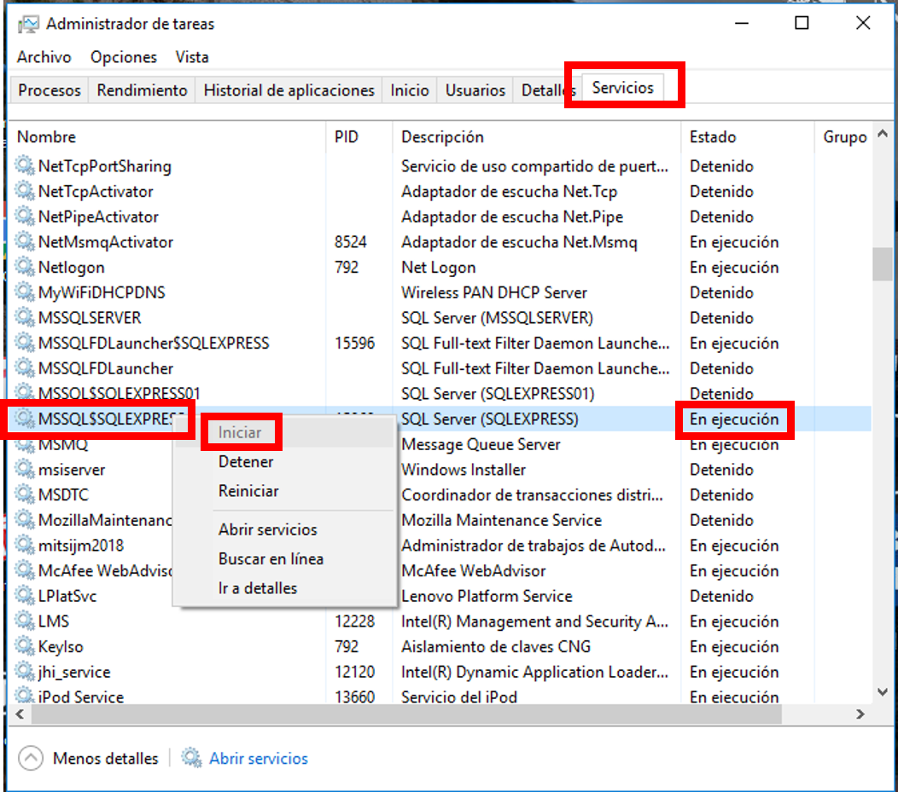

### 2.	Crear Diagramas de Bases de Datos

•	Damos click derecho en “Base de Datos”, seleccionamos “Nueva base de datos…”

   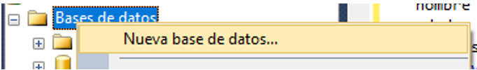

•	Asignamos un nombre a la base de datos, damos click a “Aceptar”.

   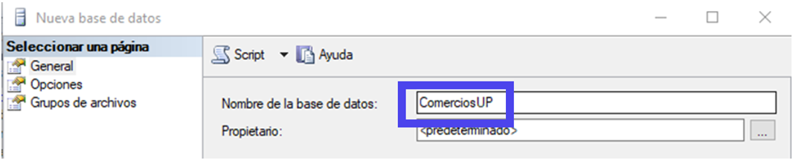

•	La base de datos se actualiza automáticamente, y muestra la base de datos creada. De no ser así, damos click derecho en “Base de datos” y seleccionamos “Actualizar”.

   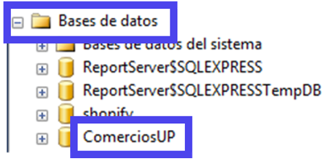

•	Nos ubicamos en nuestra base de datos, expand imos y damos click derecho en “Diagramas de base de datos”, seleccionamos “Nuevo diagrama de base de datos”.

   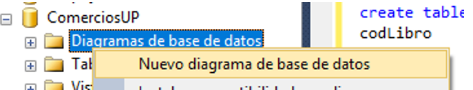

•	Nos aparecerá una ventana emergente de consulta, aceptamos. Posteriormente nos aparecerá un recuadro “Agregar tabla”, no necesitamos modificar nada allí, lo cerramos. Comenzamos a trabajar en el espacio en blanco.

   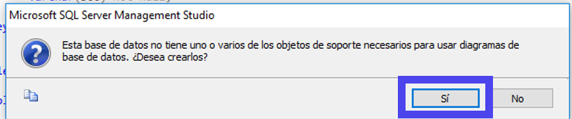

•	Caso: Replicaremos el diagrama de la base de datos de Northwind, que requiere de 13 tablas (Employees, EmployeeTerritories, Territories, Region, Orders, Shippers, Customers, CustomerCustomerDemo, CustomerDemographics, OrderDetails, Products, Categories, Suppliers), y presenta relaciones 1:M, 1:M, N:M, entre otros tópicos aprendidos en clase.

   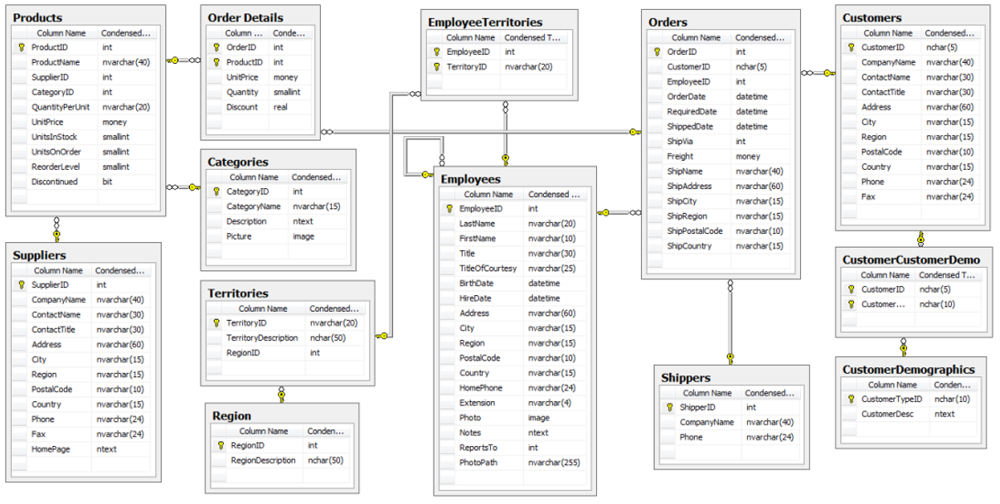
 

•	En el espacio de trabajo, dar click derecho y seleccionar “Nueva tabla…”
 
   

•	Comenzamos creando la tabla Orders, para lo cual ingresamos el nombre y aceptamos. Luego, completamos con todos los atributos y con los tipos de datos respectivos. Nota: Los tipos serán útiles para las sentencias (punto 4), para entenerlos ver Anexo 1.

   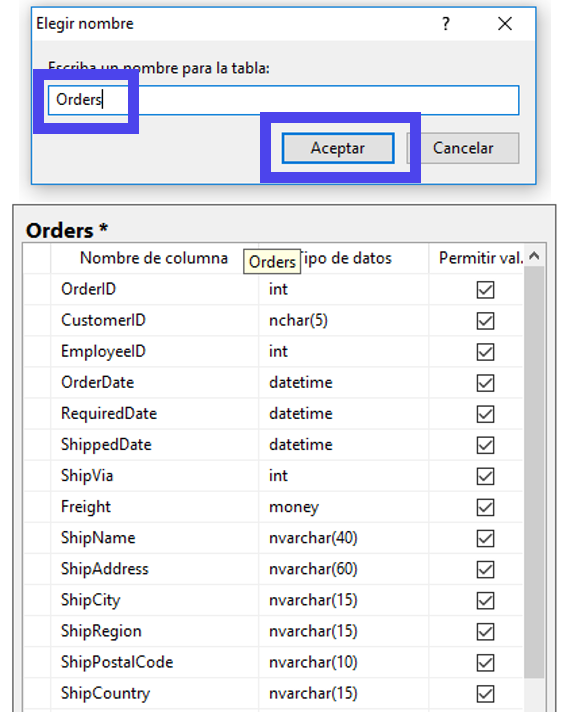
 

•	Para asignar la clave principal, nos ubicamos en el atributo respectivo y damos click derecho. Seleccionamos “Establecer clave principal”. Luego, verificamos que haya el símbolo de una llave dorada vertical.
 
   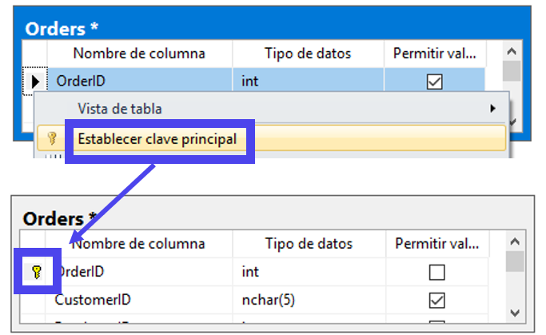
 
•	Procedemos de la misma manera que en los 3 puntos anteriores, y creamos las tablas Suppliers, Products y Order Details.

   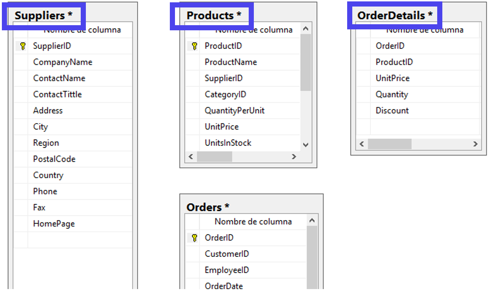

•	Para asignar una clave foránea, damos click sobre la llave (símbolo) de la clave principal de la tabla respectiva y arrastramos sin soltar hasta la clave foránea de la tabla respectiva. En este caso, arrastraremos desde “SupplierID” (clave principal) de la tabla “Suppliers” hasta “SupplierID” (clave foránea) de la tabla Products. Debe quedar como en la imagen, será necesario corroborar los pasos que se encuentran a continuación:

   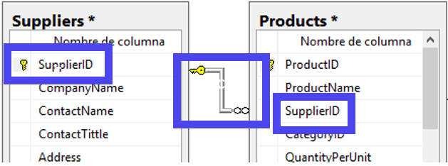 

•	Paso 1: Escoger las tablas que serán relacionadas, tanto la que contiene la clave como principal y la que la contiene como foránea.

   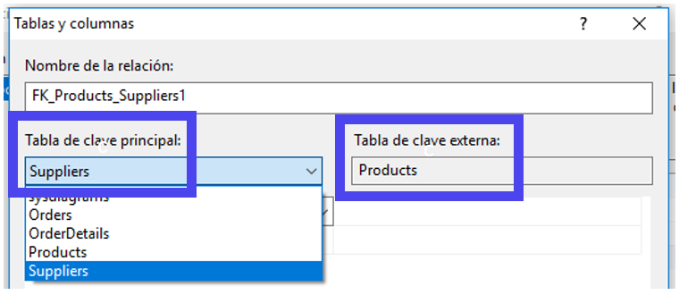

•	Paso 2: Escoger las claves principal y foránea, según corresponda la tabla.

   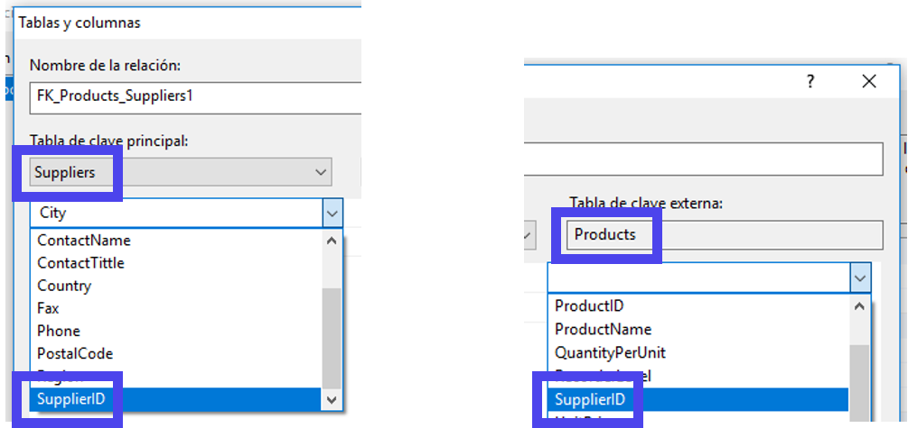			 

•	Paso 3: Con los 2 pasos anteriores ya creamos la relación, solo nos queda dar click en “Aceptar” en la ventana de confirmación de la relación creada.

   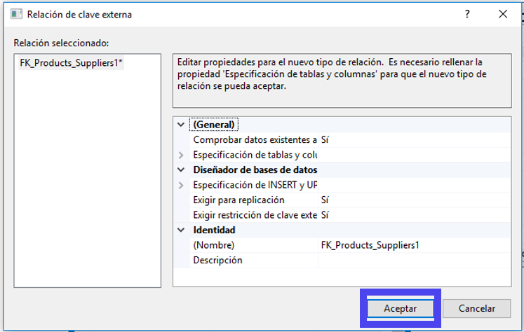

•	El resultado final debe ser el de la imagen. Notemos que al final de la relación tenemos 2 símbolos, una llave y un infinito, ellos simbolizan la relación 1:M. Después, creamos las relaciones restantes.
 

   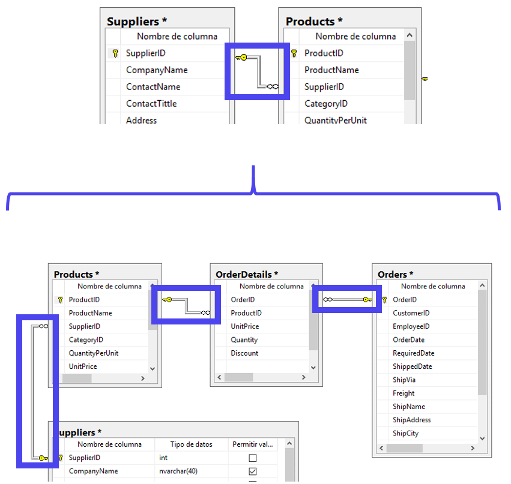
 

•	Con las tablas de nuestra base de datos completas, ya se encuentra lista para guardarla en SQL. Nos posicionamos sobre el nombre de nuestra hoja de trabajo y damos click derecho, seleccionamos “Guardar…”.

   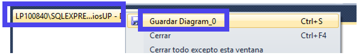

•	Escogemos un nombre que sugiera la relación del diagrama, así cuando tengamos varios nos podremos dirigir fácilmente a él. Aceptamos.

   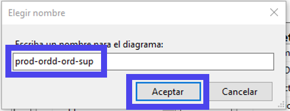

•	Damos click en “Sí”, para que se procedan a guardar las tablas que creamos dentro de nuestra base de datos.

   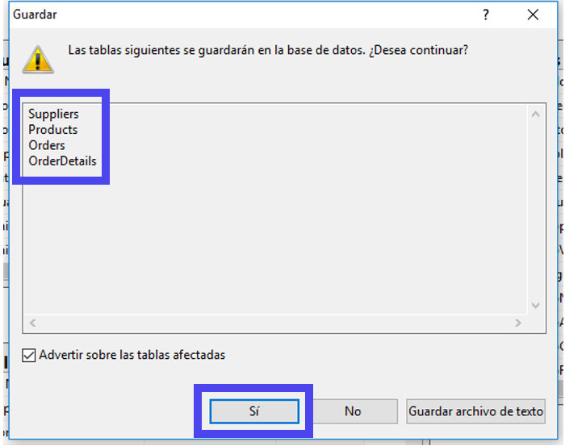

•	Nos dirigimos a nuestra base de datos, en este caso es “ComerciosUP”. Desplegamos la carpeta “Diagramas de base de datos”. Encontraremos nuestro diagrama con el nombre que escogimos en el punto anterior. Ahora, desplegamos la carpeta “Tablas” y verificamos que se hayan creado las tablas del diagrama.

   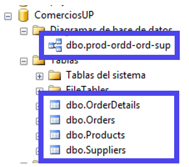
## Contenido:

<a href="https://fing-up.github.io/Ingenieria-de-datos/sql/DDL.html">II.	DDL: Data Definition Language</a>

<a href="https://fing-up.github.io/Ingenieria-de-datos/sql/DML.html">III.	DML: Data Manipulation Language</a>

<a href="https://fing-up.github.io/Ingenieria-de-datos/sql/CD.html">IV.	Consultas Condicionales</a>

<a href="https://fing-up.github.io/Ingenieria-de-datos/sql/CB.html">V.	Consultas Básicas</a>

<a href="https://fing-up.github.io/Ingenieria-de-datos/sql/CA.html">VII.	Consultas Agrupada</a>
